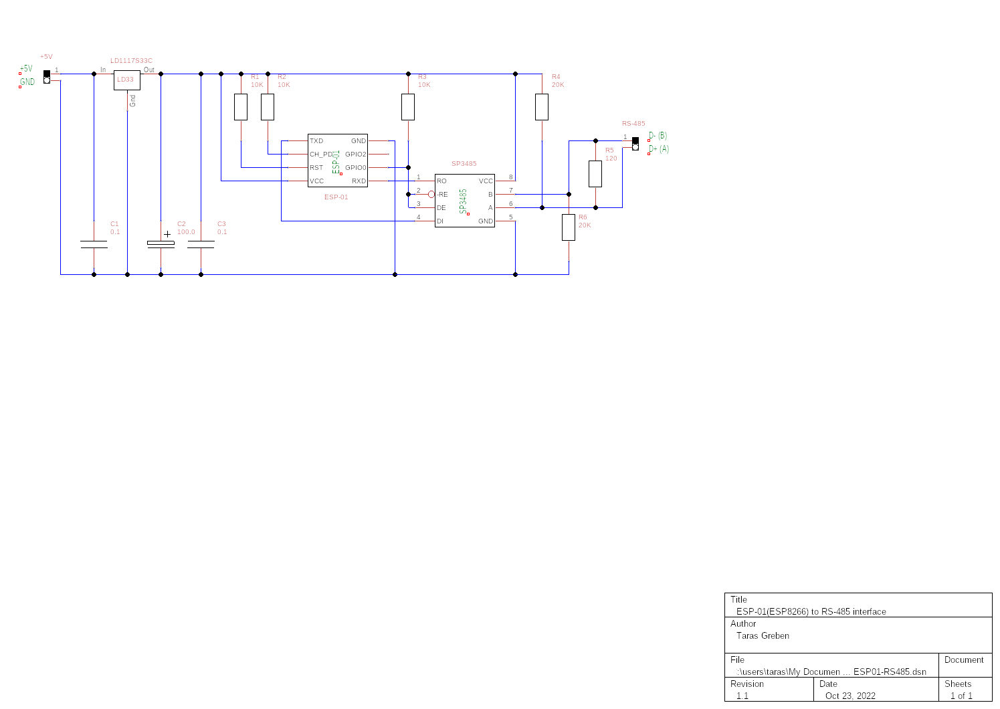

# Control Dooya curtain motors via RS-485 from the web UI hosted by NodeMCU
[Dooya](http://www.dooya.com/index_en.php) is a company that produces smart motors and other hardware for opening/closing curtains. Some of their motors (for example, [DT82TV](https://www.aliexpress.com/wholesale?SearchText=DT82TV)) can be controlled through RS-485 interface. This project shows how to connect these RS-485 enabled Dooya curtain motors with NodeMCU device to control them from a web browser.

## Features
* Single NodeMCU device can control many curtain motors (assuming all of them are wired with this NodeMCU device), and these motors can be added/configured via the web interface;
* Ability to send raw commands to RS-485 (optionally appended with the generated CRC16) from the web interface (RS-485 tab);
* The motor address may be assigned using web interface (RS-485 tab), so no other hardware/software is required to initialize the motors;

*The following features are derived from [the platform](https://github.com/dev-lab/bare-esp-iot-generic-switch) on which project is based*:
* Wi-Fi connection (such as setting up an access point, or using an existing Wi-Fi network) can be set up via the web interface;
* NodeMCU device hosts HTTP server locally, no third-party services are used and no Internet access is required;
* There is a built-in IDE for editing the software via the web interface (you can hack the software at runtime to add new features);
* Responsive Web UI (usable from smartphones);
* NodeMCU version agnostic (software can work on NodeMCU 1.5.4.1 - 3.0.0).

### Web UI overview:

#### UI overview:

#### Setup Wi-Fi access point:

#### Setup `admin` authentication:

## Hardware
### NodeMCU to RS-485 interface
This device allows NodeMCU hardware (implemented on any of the chips: ESP8266, ESP8285 and ESP32) to communicate with devices over RS-485 interface. The RS-485 interface is implemented using the SP3485 chip, as it can be powered by 3.3V (as required by ESP-01). Here is the schematic diagram (if using the simplest ESP-01 module and an existing 5V power supply):

There is nothing specific to curtain motors in the circuit, so it can also be used to control any other device with RS-485 support.

### Connecting curtain motors
All curtain motors (up to 32) must be connected by their RS-485 connector to points A and B (D+ and D-) of the circuit above, after all of them are assigned unique addresses. Here is the RS-485 socket pinout of the Dooya DT82TV curtain motor, taken from its documentation:

If the motors have not yet been assigned unique addresses, read [the next section](#assign-addresses-to-rs-485-motors) on how to do so.

## Setup

### Prepare NodeMCU software
1. Flash the ESP8266 module with the NodeMCU firmware as described in [Flashing the firmware](https://nodemcu.readthedocs.io/en/release/flash/) with any tool you like (e.g. [esptool](https://github.com/espressif/esptool), [NodeMCU Flasher](https://github.com/nodemcu/nodemcu-flasher) etc.). The custom NodeMCU firmware can be built online with the service: [NodeMCU custom builds](https://nodemcu-build.com/). If your ESP8266 EEPROM is only 512Kb (original ESP-01 module), you have to take extra steps to be sure that firmware is as small as possible, and there is enough space for project files in EEPROM file system. So, build your custom firmware based on 1.5.4.1-final NodeMCU with the only 9 modules selected: `cjson`, `encoder`, `file`, `gpio`, `net`, `node`, `tmr`, `uart`, `wifi`, no TLS, no debug, and take the integer version of it (its size is 398804 bytes in my case). In the case if your ESP module goes with larger EEPROM installed, you can build even the most recent NodeMCU version (select the `release` option on online build tool) with more modules selected, just make sure that at least 70Kb of file system space is available when you run NodeMCU. Make sure the following 9 modules are selected when you are building the firmware:
  * `encoder`;
  * `file`;
  * `GPIO`;
  * `net`;
  * `node`;
  * `SJSON` (for new NodeMCU; if you build older NodeMCU (1.5.4.1) select `cJSON` instead);
  * `timer`;
  * `UART`;
  * `WiFi`.
2. Upload the project files (all the files from [src/](src/) directory) to the ESP module (read the [Uploading code](https://nodemcu.readthedocs.io/en/release/upload/) how to do it). If you prefer, you can use the tool for uploading NodeMCU files from https://github.com/dev-lab/esp-nodemcu-lua-uploader. Upload the software with either [install.sh](install.sh), or [install.bat](install.bat) depending on your OS.
3. Restart the ESP8266 module (turn it off and turn back on). After restarting you will see a new Wi-Fi access point with the name: `esp-devlab-setup`. You will be able to connect to the module with the default password: `We1c0me!`. The default Wi-Fi AP name and password are specified in file: [`connect.lua`](./src/connect.lua).
4. On successful connection to the `esp-devlab-setup` Access Point you will be able to reach the Web UI through the browser by typing anything looking like domain name as an URL, e.g.: `any.site.my`. You can do that because the software starts a DNS liar server (it responds with the ESP8266 IP to any DNS request) in AP mode.
5. Web UI shall be quite self-explaining to use. You only have to remember that the best way to brick the software is to use Web IDE without checking twice what you are uploading to the file system. The changes are taken into account immediately. A bricked NodeMCU can be cured only with connecting of ESP module to computer through UART, formatting of NodeMCU file system, and rewriting the Lua software. In some cases you even have to re-flash the NodeMCU (e.g. if you did the mistake and removed the delay in [`init.lua`](./src/init.lua).

### Assign addresses to RS-485 motors
The address defines the destination for sending the command and consists of two bytes: `ID_H` and `ID_L` (by default they are both `0xFE`). Byte `ID_H` can be treated as a group address (or subnet address). Byte `ID_L` is the address of the devic in the group idendified by `ID_H`. Having groups allows you to send commands to multiple motors at once. For example, if several motors have the same `ID_H=0x43` (but different ID_L parts), you can send a command to all of them by specifying the address: `ID_H = 0x43, ID_L = 0x00`. In addition, if you want to broadcast the command to all groups (and all connected motors), you can address them with `ID_H = 0x00, ID_L = 0x00`.

#### Setting curtain motor address
By default, all Dooya curtain motors are available via RS-485 at `0xFEFE` address. If you want to control more than one curtain motor with a single NodeMCU, you need to assign unique addresses to each of them on your RS-485 network.
You have several options for assigning a motor address:
1. Using a computer, RS-485 adapter, and [windows executable](https://bbs.crodigynat.com/forum.php?mod=attachment&aid=MjAyfDkyMGM4MjIyfDE2NDIwNjMzMDR8MHwyMjk%3D) (available [here](https://bbs.crodigynat.com/forum.php?mod=viewthread&tid=229), RS-485 protocol is specified there too, and that is linked from [this forum](https://community.home-assistant.io/t/dooya-curtain-motor-rs485/140398)). I used this approach back in 2016, because at that time I had Windows and an RS-485 adapter, and I wanted to quickly check how Dooya motors can be controlled via RS-485.
2. Using this device (NodeMCU to RS485 adapter). Although I've never tried this to set addresses, I see no reason why it shouldn`t work.

Assuming you want to assign an address using this NodeMCU - RS485 device, here is an algorithm how to do it:
1. Connect this device to the motor's RS-485 (make sure only one motor is connected).
2. Turn on the device, go to the **RS-485** tab in [the web interface](#ui-overview), make sure the "Append CRC16" checkbox is selected.
3. Compose the "set address" command to be created according to the template: `55 00 00 02 00 02` **`ID_L ID_H`** (never set `ID_L` or `ID_H` to either `0x00` or `0xFF`). For example, if you want to make an address with `ID_L = 0x42` and with `ID_H = 0x43`, enter the following command in the input field: `55 00 00 02 00 02 42 43` (or just `5500000200024243`, without spaces). Don't click the "Submit" button yet!
4. Power on the Dooya motor.
5. Press **setup** button on Dooya motor for 5 seconds: the LED flashes twice. The button is located opposite to the LED on the same side of the DT82TV motor, as shown on the picture below.
6. Click the "Submit" button on the web interface, and the command from the input box will be appended with CRC16 bytes and sent to the motor. You must quickly click the "Submit" button (in up to 10 seconds) after the LED flashes twice in the previous step (indicating that address writing is allowed).
7. When the address is set successfully, the LED on the curtain motor flashes 5 times and you will see a response command on the web interface (containing the address you just set), something like: `55 42 43 02 00 02 {two CRC16 bytes}`.

For reference, here is a picture taken from the Dooya DT82TV documentation on how to set-up RS-485 address:

### Configuring motors in the web interface
Now that all motors have unique addresses, you can connect them to the NodeMCU and configure them in [the web interface](#ui-overview). Go to the **Devices** tab in the web interface, and add all the motors using the **Add** button. Give them labels (which will appear on the **Control** page), and assign **ID_H** and **ID_L** addresses in the appropriate edit fields. If you want, you can also create artificial devices for broadcasting messages to multiple motors. For example, I configured the virtual device **All** with `ID_H=0` and `ID_L=0` to open/close all curtains at once.

## Using
Navigate to the **Control** tab of the [web interface](#ui-overview). Initially, it will try to read the state of your curtains (querying all the motors in the sequence, except for virtual devices with `ID_H == 0x00`). This may take some time, depending on the number of the motors configured. In addition, loading the curtain position (as a percentage) can sometimes fail, for example, if the curtains were never closed after powering the motors (for example, after a loss of power). If the initial state cannot be loaded, the web interface ignores it and still allows you to open/close the curtains. Note, that when the motors lose their power, you can first only fully open/close curtains (the percentage setting will not work until you close the curtains completely at least once).

## [License](./LICENSE)
Copyright (c) 2016-2022 Taras Greben 

Licensed under the [Apache License](./LICENSE).
